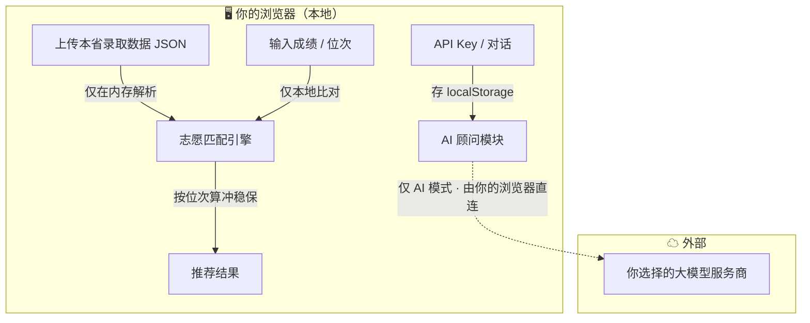

<div align="center">

# 🎓 智慧大学 · 高考志愿决策参考工具

**上传本省录取数据，几分钟生成你的「冲 / 稳 / 保」志愿表 — 纯本地、免注册、不收集任何信息**

[](LICENSE)
[](index.html)
[](#-隐私与数据如何流动)
[](data/province_rules.json)
[](#-参与贡献)

### [▶ 在线免登录体验 (GitHub Pages)](https://shengdabai.github.io/college-major-selector/)

> 🔒 录取数据、成绩、位次只在你的浏览器里解析，**不经过任何服务器**。

[English README →](README_EN.md)


</div>

---

基于教育部公开数据（**2,756 所院校 · 860 个本科专业**），面向高三学生与家长的志愿决策**参考**工具。上传本省历年录取数据即可生成冲 / 稳 / 保推荐，内置全国 31 省志愿填报规则，并可接入任意大模型作 AI 顾问。**纯静态网页，无需后端、无需注册、核心计算与你的数据均在浏览器本地完成。**

## ✨ 为什么用它

| | |
|---|---|
| 🗺️ **全国通用** | 不绑定任何省份，上传本省数据即用，内置 31 省志愿规则 |
| 🔒 **隐私本地化** | 录取数据 / 成绩 / 位次在浏览器本地解析，不上传服务器 |
| 🚀 **零注册 · 免安装** | 打开网页即用，无需账号；纯静态、可自行部署到任意静态托管 |
| 🤖 **接入任意 AI** | OpenAI / DeepSeek / 通义千问 / Kimi / 智谱 / 豆包 / 文心… 一键切换 |
| 📊 **冲稳保推荐** | 按位次比例匹配，推荐数量按本省平行志愿数自适应 |
| 📖 **数据公开可查** | 院校 / 专业来自教育部公开名单，规则附各省考试院来源 |

---

## 🚀 快速开始

**方式一：在线体验（零安装，推荐）**

直接打开 → **<https://shengdabai.github.io/college-major-selector/>**
点首页模式三的「🔮 一键载入示例数据」即可立刻看到冲稳保推荐效果，无需准备任何数据。

**方式二：本地运行**

```bash
git clone https://github.com/shengdabai/college-major-selector.git
cd college-major-selector

# 启动本地服务器（任选其一）
python3 -m http.server 8000
# 或  npx serve .

open http://localhost:8000
```

> ⚠️ 不能直接双击 `index.html`，浏览器会拦截本地 `fetch` 请求，必须通过本地服务器或在线 Demo 访问。

---

## 🧭 五种使用模式

| 模式 | 你能做什么 |
|------|-----------|
| **01 地域 → 学校 → 专业** | 按省份 / 城市 / 等级 / 类型筛选院校，展开看开设专业与优势专业 |
| **02 专业 → 地域 → 学校** | 选定专业反查全国开设院校，按省份 / 等级 / 优势二次筛选 |
| **03 录取数据 · 分数推荐** | 上传本省录取 JSON（或一键载入示例），按位次生成冲 / 稳 / 保三档推荐，数量按本省平行志愿数自适应 |
| **04 大学专业顾问** | 接入任意 OpenAI 兼容大模型（含国产 API），内置高考志愿专家系统提示词 |
| **05 各省志愿规则** | 全国 31 省高考模式（3+3 / 3+1+2 / 文理）、志愿模式、平行志愿数、批次速查 |

<table>
<tr>
<td width="50%"><br><div align="center"><sub>模式三 · 冲稳保推荐</sub></div></td>
<td width="50%"><br><div align="center"><sub>模式四 · AI 大学专业顾问</sub></div></td>
</tr>
</table>

---

## 🔐 隐私与数据如何流动

本工具的核心承诺是**把你的敏感数据留在本地**。数据流动一目了然：



- 院校 / 专业 / 各省规则数据随仓库自带（`data/`），打开即用。
- 你上传的录取数据、成绩、位次**只在浏览器内存与 localStorage 中处理，本项目没有任何后端服务器去接收它们**。
- 仅模式四（AI 顾问）会把你输入的问题，由你的浏览器**直接**发送给你自己配置的大模型服务商（如 DeepSeek 官方接口）——这一步**不经过本项目服务器**，但确实会到达你选的 AI 服务商。API Key 也只存在你本机浏览器里。

---

## 📥 准备本省数据（模式三）

### 小白三步法

1. **先体验**：点模式三「🔮 一键载入示例数据」，或「↓ 下载 JSON 模板/示例」看格式。
2. **填数据**：从本省教育考试院 / 阳光高考平台获取公开的招生计划、专业录取分、一分一段表，照模板填进 JSON（文件名含 4 位年份，如 `2025.json`）。
3. **上传使用**：把 JSON 拖进上传区，分数推荐、院校趋势、招生计划三个子功能自动启用。

<details>
<summary>开发者：用脚本批量把 Excel 转成 JSON</summary>

```bash
# 按你本省 Excel 的表头修改 scripts/build_admission_json.py 里的 COLUMN_MAP
python3 scripts/build_admission_json.py <你的Excel.xlsx> 2025 --province 河南 --subject 物理类
# 生成 data/2025.json，再到网页上传
```
JSON 字段契约见 `scripts/build_admission_json.py` 顶部注释。
</details>

---

## ❓ 常见问题

**Q：我的成绩和录取数据会被上传吗？**
不会。本项目没有后端服务器，你上传的数据只在浏览器本地解析。唯一的网络请求是模式四 AI 顾问——由你的浏览器直连你自己配置的大模型服务商，不经过本项目。

**Q：支持我们省吗？**
支持任意省份。工具不内置任何省份的录取数据，你上传本省公开数据即可；各省志愿规则（模式五）已覆盖全国 31 省。

**Q：为什么不直接内置各省录取数据？**
全国各省各科类录取数据每年数十万条，全内置会让网页体积巨大且很快过时。改为本地上传：秒开、可用最新数据、且不替你保管敏感数据。

**Q：AI 顾问的 API Key 安全吗？**
API Key 只存在你本机浏览器的 localStorage，请求由浏览器直发服务商官方接口（或你的自建代理），本项目不设任何收集 Key 的服务器。

**Q：推荐结果可以直接照着填志愿吗？**
不可以。本工具仅供**参考**，推荐基于历年位次比例。最终请以学校招生章程与本省教育考试院当年正式公告为准。

---

## 📂 项目结构

```
.
├── index.html                    # 单文件 SPA 主页面
├── app.js                        # 全部交互逻辑（纯前端）
├── data/
│   ├── universities.json         # 全国高校数据（2,756 所）
│   ├── majors.json               # 本科专业目录（860 个）
│   ├── province_rules.json       # 全国 31 省志愿填报规则
│   └── demo-admission-2025.json  # 合成示例数据（非真实，仅供体验）
├── scripts/build_admission_json.py  # Excel→JSON 通用转换模板
└── docs/screenshot-*.png         # 界面截图
```

---

## 🤝 参与贡献

欢迎提交 Issue 与 PR：补充 / 修正各省志愿规则、改进 UI、补充数据转换脚本等。
请先阅读 [SECURITY.md](SECURITY.md)，并确保不提交任何真实考生 / 个人隐私数据。

## 📜 数据来源与免责声明

- 教育部《全国普通高等学校名单》、《普通高等学校本科专业目录》、985/211/双一流官方名单
- 各省志愿规则：公开信息整理，附各省教育考试院来源，**以官方当年公告为准**
- 录取数据：由用户自行上传，**本项目不内置任何省份录取数据**
- 「开设专业 / 优势专业」为基于学校类型的启发式推断；分数推荐基于历年位次比例，仅供参考，**不构成志愿填报建议**

## License

[MIT](LICENSE) — 自由使用，欢迎 PR 与 Issue。
