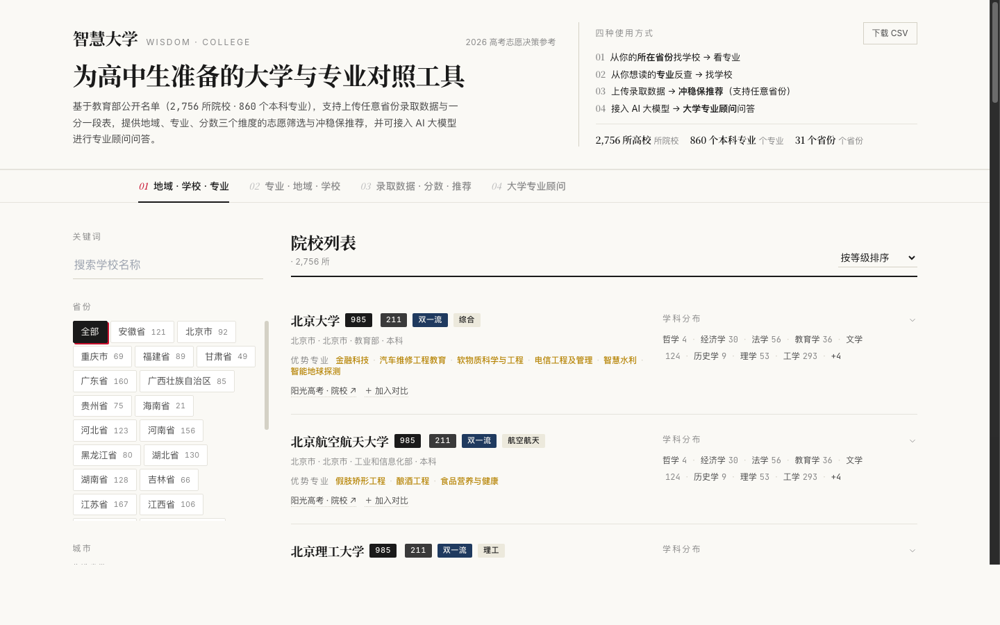
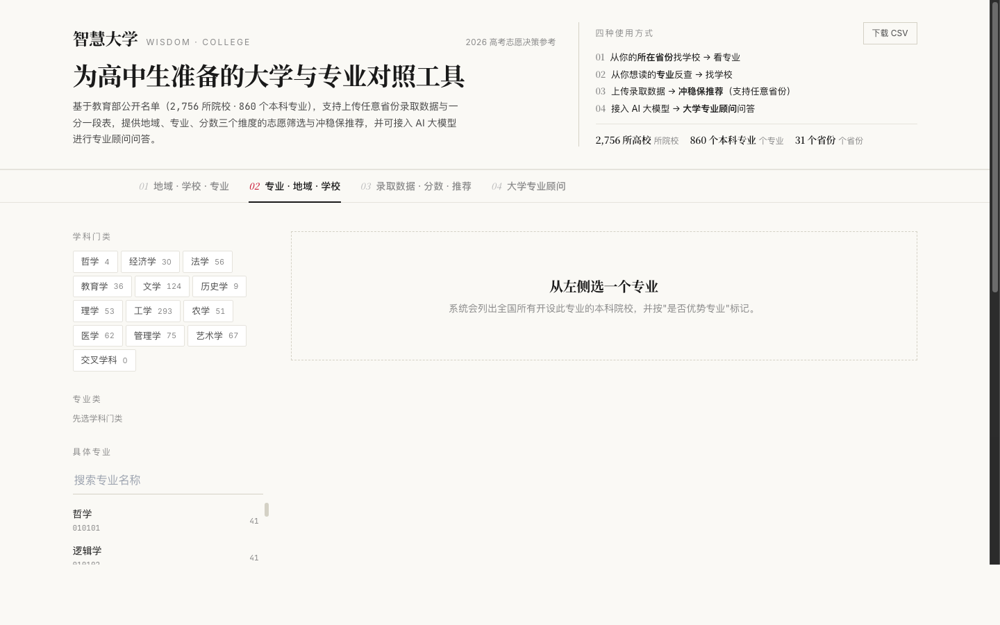
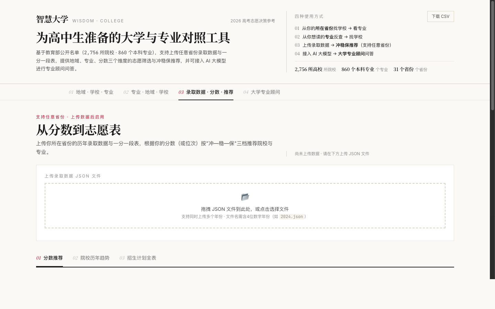
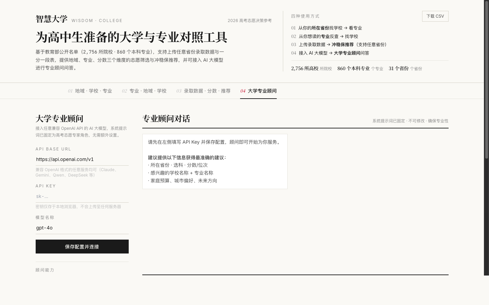

# University Major Selector · Gaokao Decision Tool

> A browser-based tool for Chinese high school students — supports any province's data · plug in any AI model

**[中文说明 →](README.md)**



---

Built on Ministry of Education public data (**2,756 universities · 860 undergraduate majors**), this tool helps students and parents make informed university and major choices. Pure static HTML — no backend, no registration, works fully offline.

---

## Four Modes

| Mode | Description |
|------|-------------|
| **01 Region → School → Major** | Filter universities by province/city/tier/type; view majors offered |
| **02 Major → School** | Pick a major, find all universities offering it nationwide |
| **03 Score-Based Recommendation** | Upload your province's admission data; get reach/match/safety recommendations |
| **04 AI University Advisor** | Connect any OpenAI-compatible AI; system prompt is fixed by expert advisors |

---

## Quick Start

```bash
git clone https://github.com/shengdabai/university-major-selector.git
cd university-major-selector

# Start a local server (pick one)
python3 -m http.server 8000
# or
npx serve .

# Open in browser
open http://localhost:8000
```

> You must use a local server — opening `index.html` directly will fail due to browser `fetch` restrictions.

---

## Mode 2: Major → School



Three-level drill-down: discipline category → subject group → specific major. Filter results by province, university tier, and whether it's a featured/key program.

---

## Mode 3: Upload Province Data · Score Recommendations



### Data You Need

- Historical **enrollment plans** (school, major, seats, tuition, subject requirements)
- Historical **major admission scores** (minimum score, minimum rank)
- Historical **school admission scores** (minimum score, minimum rank)
- Historical **rank tables** (score → cumulative count)

Source: your province's official college entrance exam website (all public data)

### JSON Format

File name must contain a 4-digit year (e.g. `2024.json`):

```json
{
  "plans": [...],
  "majorScores": [...],
  "schoolScores": [...],
  "rankTable": [{ "score": 680, "cum": 120 }],
  "_meta": { "province": "YourProvince", "year": 2024, "subject": "Physics" }
}
```

See `scripts/parse_qinghai_history.py` as a reference for converting Excel data to this format. Multiple year files can be uploaded at once.

---

## Mode 4: AI University Advisor



Fill in your API credentials on the left panel and click "Save & Connect". The AI advisor sends an opening message automatically.

| Provider | API Base URL | Recommended Model |
|----------|-------------|-------------------|
| OpenAI | `https://api.openai.com/v1` | `gpt-4o` |
| DeepSeek | `https://api.deepseek.com/v1` | `deepseek-chat` |
| Alibaba Qwen | `https://dashscope.aliyuncs.com/compatible-mode/v1` | `qwen-max` |
| Any Proxy | your proxy URL | model name |

- The system prompt is fixed by expert Gaokao advisors — you cannot modify it, ensuring consistent quality
- Your API key is stored only in your browser's localStorage; it is never sent to any server other than your chosen AI provider

---

## Project Structure

```
.
├── index.html              # Single-page app
├── app.js                  # All interaction logic
├── data/
│   ├── universities.json   # 2,756 universities
│   └── majors.json         # 860 undergraduate majors
├── scripts/
│   └── parse_qinghai_history.py   # Data processing script (adapt as needed)
└── docs/
    └── screenshot-*.png    # UI screenshots
```

---

## Data Sources

- Ministry of Education: *National List of Regular Higher Education Institutions* (2021)
- *Catalog of Undergraduate Majors in Regular Higher Education Institutions* (2026)
- Official lists of 985 / 211 / Double First-Class universities
- Admission data: uploaded by the user — **no province-specific data is bundled with this project**

## Disclaimer

- "Majors offered" and "featured programs" are heuristic inferences based on school type, not official data
- Score recommendations are based on historical rank percentiles and are for reference only
- Always consult your school's official enrollment prospectus and your province's education examination authority

---

## License

MIT — free to use, PRs and issues welcome.
